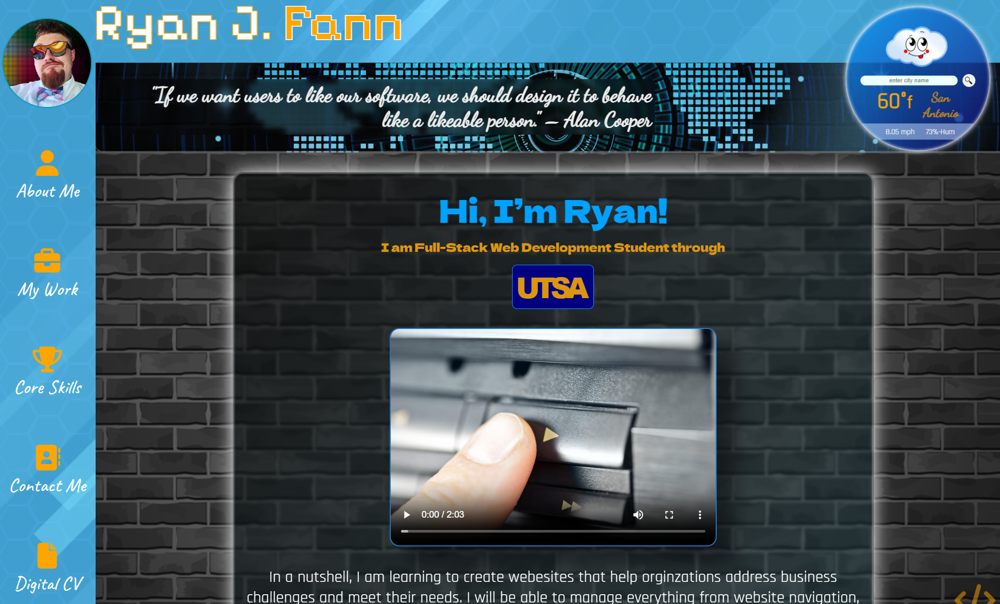
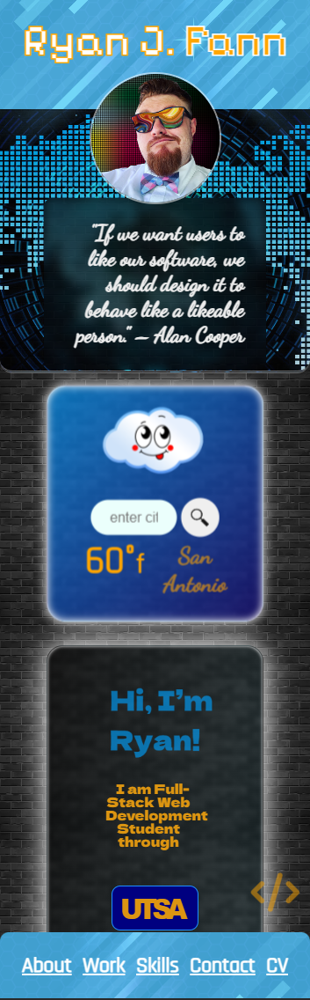

# Student Portfolio

## Description
A project to create a landing page to display current and past projects to prospective employers, other developers, and others.

## Table of Contents
1. [Screenshot](#screenshot)
2. [Roadmap](#roadmap)
5. [License](#license)
7. [Links](#links)
8. [Questions](#support)

---

## Screenshot
> 
> 
> 

---

## Roadmap
Will be adding future projects as well as additional JS code and possibly 3rd Party APIs

## License
[MIT](https://opensource.org/licenses/MIT)

---

## Links
### Repo Link:
 https://github.com/8BitGinger/studentPortfolio/
### Deployed Link:
https://8bitginger.github.io/studentPortfolio/

---

## Questions
Reach out for Questions or Support here:
### Email: 
ryan.fann@gmail.com
#### GitHub Username: 
[8BitGinger](https://github.com/8BitGinger)

